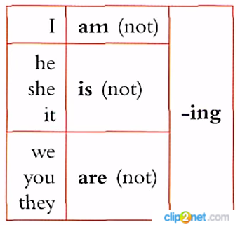
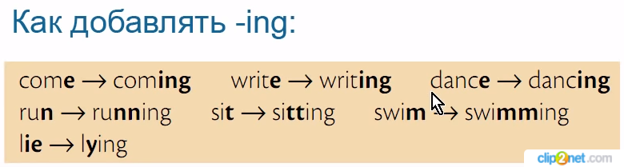
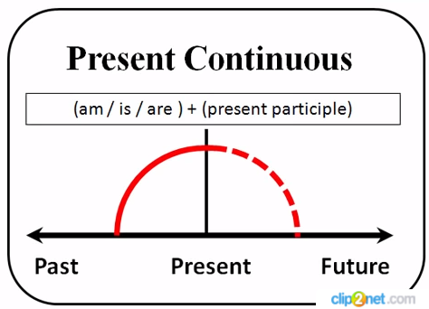
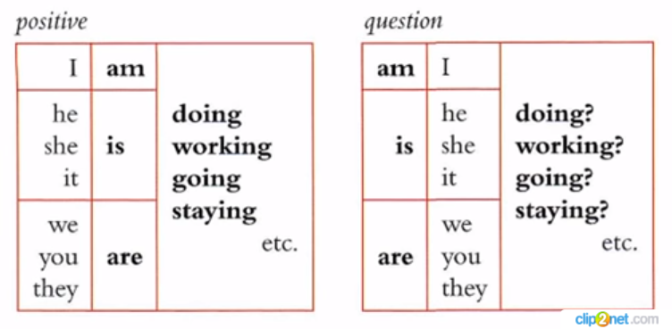

# Grammar

## Времена

### Present Contitnuous

**Случаи употребления**

|№|Случай употребления|Пример|
|-|-|-|
|1|*Действие происходит прямо сейчас*|**I am writing** a letter to my sister now, don’t bother me. Я сейчас пишу письмо сестре, не беспокой меня.|
|2|*Действие в ближайшем будущем (Обычно с обстоятельством времени)*|My wife **is coming** in a minute. Моя жена придет через минуту.|
|3|*При выражении негодования. (Как правило сопровождается словом `always`)*|They **are always arguing**. они постоянно спорят.|
|4|*Длительный процесс, в котором есть изменения. Какой-то определенный тренд или тенденция (не обязательно в текущий момент)*|Mike **is studing** hard to become a doctor. Майк усердно учится, чтобы стать доктором.|

**Маркеры:**

* right now
* now
* at the moment