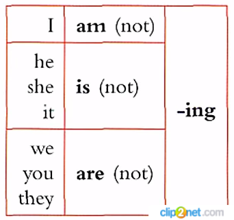
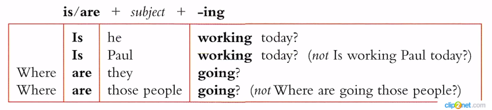

[Грамматика Английского](../README_EN_GRAMMAR.md)

# Future Continuous

## Случаи употребления

|#|Случай употребления|Пример|
|-|-|-|
|1|Действие в развитии, незаконченное, происходящее либо в определенный момент в будущем, либо в течение целого периода в будущем|I'**ll be waiting** for you at 5 o'clock. *Я буду ждать вас в 5 часов.* I'**ll be translating** this article all day long tomorrow. *Завтра я целый день буду переводить эту статью.*|
|2|Действие, которое будет совершаться, протекать в тот момент, когда произойдет другое действие, выраженное глаголом в форме **Present Simple** (в придаточных предложениях времени, начинающихся со слова **when** *когда*)|I'**ll be working** when you come. *Я буду работать, когда вы придете.*|
|3|Параллельные действия в будущем, т. е. протекающие в одно и то же время (в придаточных предложениях времени, начинающихся со слова **while** *пока, в то время как*)|He **will be reading** while the children **will be swimming**. *Он будет читать, пока дети будут купаться.*|
|4|Действие в будущем, которое явится результатом естественного хода событий, причем точное время его совершения может быть не указано|I'**ll** soon **be starting** my studies in King's College. *Скоро я буду учиться в Королевском колледже.*|

<!-- 

**Короткие ответы**

**Маркеры:**

* right now
* now
* at the moment -->

Форма вспомогательного глагола **shall** является устаревшей, в разговорной речи не употребляется (всегда используется вспомогательный глагол **will**):

* I **will** answer you question. *Я отвечу на Ваш вопрос.*

Употребление **shall** в качестве вспомогательного глагола для образования будущего времени можно встретить в официальных и устаревших текстах, старых учебниках.

Однако **shall** употребляется в вопросительных предложениях, когда требуется узнать мнение собеседника о целесообразности совершения действия:

* **Shall** I open the window? *Мне открыть окно?*

Помните, что **shall** может быть не только вспомогательным, но и модальным глаголом со значением долженствования ("должен"). Для этого случая характерно употребление с 3-м лицом единственного числа:

* He **shall** do it! *Он должен сделать это!*

Краткая форма для **will** и **shall** одинакова - апостроф и двойная "l" - '**ll**:

* **I'll** be back! *Я вернусь!*

Краткие отрицательные формы: **will not = won't** (**shall not = shan't** - практически не используется):

That **won't** do any good! *От этого толку не будет!*

***

**В придаточных предложениях времени и условия вместо форм Future используются формы Present: Present Simple (Indefinite) вместо Future Simple (Indefinite), Present Continuous (Progressive) вместо Future Continuous (Progressive), Present Perfect вместо Future Perfect.**

Тем не менее, на русский язык такие предложения переводятся будущим временем:

* I will come if I **have** time. *Я приду, если у меня **будет** время* (придаточное условия).
* I will tell him about it when I **see** him. *Я расскажу ему об этом, когда **увижу** его* (придаточное времени).

