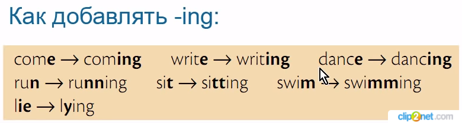
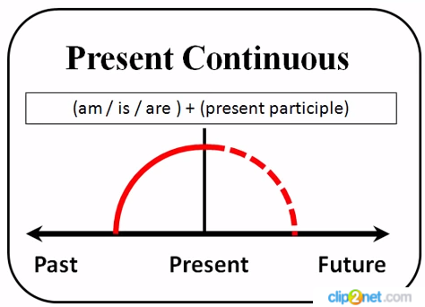

[Грамматика Английского]('../README_EN_GRAMMAR.md)

# Present Continuous

## Случаи употребления

|#|Случай употребления|Пример|
|-|-|-|
|1|*Действие происходит прямо сейчас*|**I am writing** a letter to my sister now, don’t bother me. *Я сейчас пишу письмо сестре, не беспокой меня.*|
|2|*Действие в ближайшем будущем (Обычно с обстоятельством времени)*|My wife **is coming** in a minute. *Моя жена придет через минуту.*|
|3|*При выражении негодования. (Как правило сопровождается словом `always`)*|They **are always arguing**. *Они постоянно спорят.*|
|4|*Длительный процесс, в котором есть изменения. Какой-то определенный тренд или тенденция (не обязательно в текущий момент)*|Mike **is studing** hard to become a doctor. *Майк усердно учится, чтобы стать доктором.*|

**Короткие ответы**

**Маркеры:**

* right now
* now
* at the moment

