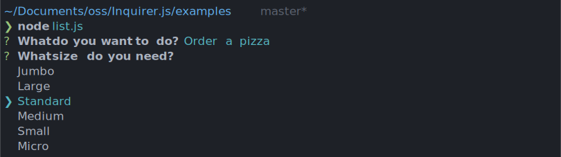
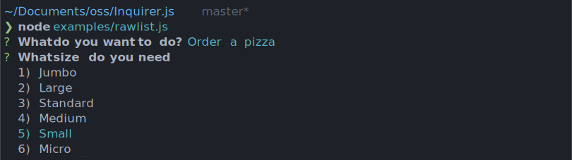
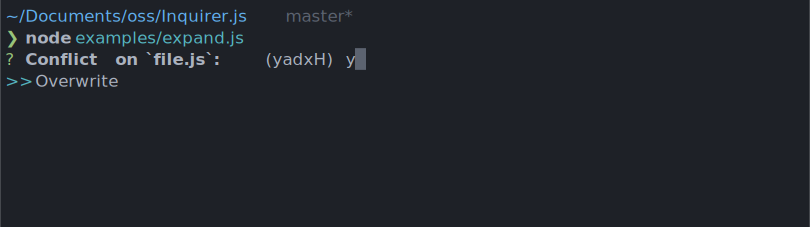
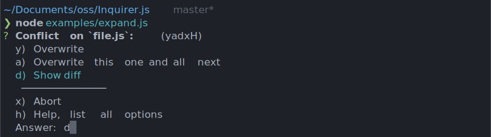
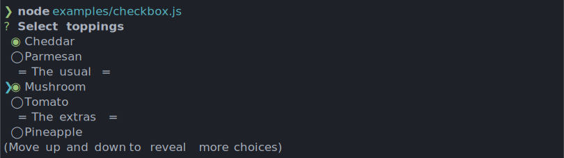
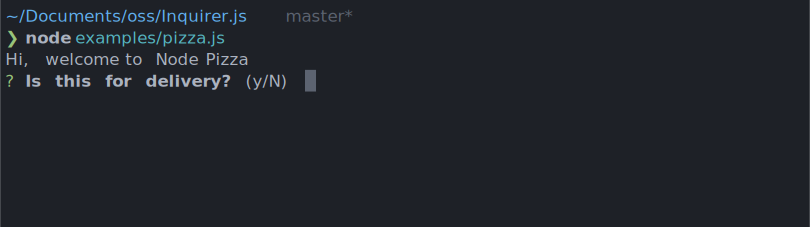
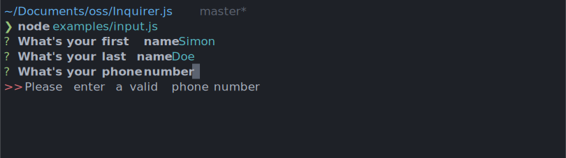
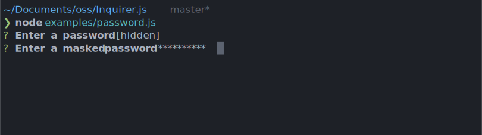

# Inquirer

## Базовое использование

```javascript
var inquirer = require('inquirer');
inquirer
  .prompt([
    /* Передайте ваши вопросы здесь */
  ])
  .then(answers => {
    // Использовать обратную связь с пользователем для ... чего угодно !!
  });
```

## Свойства объекта

* `type`: **(String)** Тип приглашения. Значения по умолчанию: `input`- Возможные значения: `input`, `number`, `confirm`, `list`, `rawlist`, `expand`, `checkbox`, `password`, `editor`
* `name`: **(String)** Имя, используемое при сохранении ответа в хэше ответов. Если имя содержит точки, оно будет определять путь в хэше ответов.
* `message`: **(String|Function)** Вопрос для печати. Если он определен как функция, первым параметром будут текущие ответы на сеанс опроса. По умолчанию используется значение `name` (за которым следует двоеточие).
* `default`: **(String|Number|Boolean|Array|Function)** Значения по умолчанию, которые следует использовать, если ничего не введено, или функция, которая возвращает значения по умолчанию. Если он определен как функция, первым параметром будут текущие ответы на сеанс опроса.
* `choices`: **(Array|Function)** Массив выбора или функция, возвращающая массив выбора. Если он определен как функция, первым параметром будут текущие ответы на сеанс опроса. Значения массивов может быть простым `numbers`, `strings` или `objects` содержащий `name` (для отображения в списке), A `value` (сохранить в хэш - ответы) и `short` (для отображения после выбора) свойств. Массив выбор может также содержать. `Separator`
* `validate`: **(Function)** Получает пользовательский ввод и отвечает на хеш. Должен возвращаться, `true` если значение допустимо, и сообщение об ошибке (`String`) в противном случае. Если `false` возвращается, предоставляется сообщение об ошибке по умолчанию.
* `filter`: **(Function)** Получите пользовательский ввод и верните отфильтрованное значение, которое будет использоваться внутри программы. Возвращаемое значение будет добавлено в хэш ответов .
* `transformer`: **(Function)** Получает пользовательский ввод, отвечает на хеш и флаги опций и возвращает преобразованное значение для отображения пользователю. Преобразование влияет только на то, что показано при редактировании. Он не изменяет хэш ответов.
* `when`: **(Function, Boolean)** Получает текущий хэш ответов пользователя и должен возвращать `true` или в `false` зависимости от того, должен ли этот вопрос быть задан. Значение также может быть простым логическим значением.
* `pageSize`: **(Number)** Изменить количество строк , которые будут оказаны при использовании `list`, `rawList`, `expand` или `checkbox`.
* `prefix`: **(String)** Изменить префиксное сообщение по умолчанию .
* `suffix`: **(String)** Изменить сообщение суффикса по умолчанию .

*`default`, `choices` (если определены как функции) `validate`, `filter` и `when` функции могут вызываться асинхронно. Либо верните `Promise`, либо используйте `this.async()` для получения обратного вызова, которому вы позвоните с окончательным значением.*

## Типы `prompt`

### List - `{type: 'list'}`

Возьмем `type`, `name`, `message`, `choices`[ , `default`, `filter`] свойства. (Обратите внимание, что по умолчанию должен быть выбор `index` в массиве или выбор `value`)



### Raw List - `{type: 'rawlist'}`

Возьмем `type`, `name`, `message`, `choices`[, `default`, `filter`] свойства. (Обратите внимание, что по умолчанию должен быть выбор `index` в массиве)



### Expand - `{type: 'expand'}`

Возьмем `type`, `name`, `message`, `choices`[, `default`] свойства. (Обратите внимание, что по умолчанию должен быть выбор `index` в массиве. Если `default` ключ не предоставлен, то `help` будет использоваться как выбор по умолчанию)

Обратите внимание, что `choices` объект примет дополнительный параметр, вызываемый `key` для `expand` приглашения. Этот параметр должен быть одним (в нижнем регистре) символом. `h` Добавлена опция в командной строке и не должны быть определены пользователем.




### Checkbox - `{type: 'checkbox'}`

Возьмем `type`, `name`, `message`, `choices`[, `filter`, `validate`, `default`] свойства. `default` ожидается, что это будет массив значений проверенных вариантов.

Варианты, отмеченные как, `{checked: true}` будут отмечены по умолчанию.

Выбор, чье свойство `disabled` правдиво, не будет выбран. Если `disabled` это строка, то строка будет выведена рядом с отключенным выбором, в противном случае она будет по умолчанию `"Disabled"`. `disabled` Свойство также может быть синхронной функцией приема текущих ответов в качестве аргумента и возвращают логическое значение или строку.



### Confirm - `{type: 'confirm'}`

Возьмем `type`, `name`, `message`, [ `default`] свойства. `default` как ожидается, будет логическим, если используется.



### Input - `{type: 'input'}`

Возьмем `type`, `name`, `message`[, `default`, `filter`, `validate`, `transformer`] свойства.



### Input - `{type: 'number'}`

Возьмем `type`, `name`, `message`[, `default`, `filter`, `validate`, `transformer`] свойства.

### Password - `{type: 'password'}`

Возьмем `type`, `name`, `message`, `mask` [, `default`, `filter`, `validate`] свойства.



Обратите внимание, что `mask` требуется, чтобы скрыть фактический пользовательский ввод.

### Editor - `{type: 'editor'}`

Возьмем `type`, `name`, `message`[, `default`, `filter`, `validate`] свойства

Запускает экземпляр предпочитаемого пользователями редактора во временном файле. Как только пользователь выходит из редактора, содержимое временного файла считывается как результат. Используемый редактор определяется чтением переменных среды $VISUAL или $EDITOR. Если ни один из них отсутствует, используется блокнот (в Windows) или vim (в Linux или Mac).

## Тип `checkbox`

*Позволяет выбрать несколько позиций*

```javascript
const inquirer = require('inquirer');

inquirer
  .prompt([
    {
      type: 'checkbox',
      message: 'Select toppings', // Задаваемый вопрос
      name: 'toppings', // ключ объета, куда попадут текущие данные
      choices: [ // Варианты ответов
        new inquirer.Separator(' = The Meats = '), // Резделитель
        {
          name: 'Pepperoni'
        },
        {
          name: 'Olives',
          disabled: 'Out of stock' // Неактивное поле
        },
        new inquirer.Separator(' = The Cheeses = '),
        {
          name: 'Mozzarella',
          checked: true // выбранное по умолчанию
        },
        {
          name: 'Cheddar'
        }
      ],
      validate: function(answer) { // Необязательная валидация
        if (answer.length < 2) {
          return 'You chose less than 2 elements';
        }
        return true;
      }
    }
  ])
  .then((answers) => {
    console.log(JSON.stringify(answers, null, ' '));
  });
```

## Тип `editor`

*Позволяет ввести в значение текст в редакторе текста по умолчанию. Переход на новую строку сохраняется как `\r\n`*

```javascript
const inquirer = require('inquirer');

const questions = [
  {
    type: 'editor',
    name: 'bio', // имя поля
    message: 'Please write a short bio of at least 3 lines',
    validate: function(text) { // Необязательная валидация
      if (text.split('\n').length < 3) {
        return 'Must be at least 3 lines';
      }
      return true;
    }
  }
];

inquirer
  .prompt(questions)
  .then((answers) => {
    console.log(JSON.stringify(answers, null, ' '));
  });
```

## Тип `expand`

*Призывает ввести один из прелагаемых ключей `key`. Возвращает объект, где значение поля будет значение `value` из элемента с выбранным `key`. Ключ `h` по умолчанию занят помощью (выводит список имеющихся ключей при Enter)*

```javascript
const inquirer = require('inquirer');

inquirer
  .prompt([
    {
      type: 'expand',
      message: 'Conflict on `file.js`: ', // Призываемое к диалогу сообщение
      name: 'overwrite', // Имя свойства, куда попадет результат
      choices: [
        {
          key: 'y', // Выбираемый ключ
          name: 'Overwrite', // Показываемое сообщение при выборе ключа
          value: 'overwrite' // Значение, сохраняемое при выборе данного ключа
        },
        {
          key: 'a',
          name: 'Overwrite this one and all text',
          value: 'overwrite_all'
        },
        {
          key: 'd',
          name: 'Show diff',
          'value': 'diff'
        },
        new inquirer.Separator(), // Разделитель выводиться только при помощи
        {
          key: 'x',
          name: 'Abort',
          value: 'abort'
        }
      ]
    }
  ])
  .then((answers) => {
    console.log(JSON.stringify(answers))
  });
```

## Тип `input`

*Позволяет ввести в данные произвольную строку*

```javascript
const inquirer = require('inquirer');

const questions = [
  {
    type: 'input',
    name: 'first_name', // Ключ, где будет сохранена введенная строка
    message: "What's your name?" // Сообщение призывающее ввести строку
  },
  {
    type: 'input',
    name: 'last_name',
    message: "What's your last name?",
    default: function() { // Устанавливает значение по умолчанию
      return 'Doe';
    }
  },
  {
    type: 'input',
    name: 'phone',
    message: "What's your phone number?",
    validate: function(value) { // Установка валидации вводимой строки
      var pass = value.match(
        /^([01]{1})?[-.\s]?\(?(\d{3})\)?[-.\s]?(\d{3})[-.\s]?(\d{4})\s?((?:#|ext\.?\s?|x\.?\s?){1}(?:\d+)?)?$/i
      );
      if (pass) {
        return true;
      }
      return 'Please enter a valid a phone number in format XXX-XXX-XXXX';
    }
  }
];

inquirer
  .prompt(questions)
  .then((answers) => {
    console.log(JSON.stringify(answers));
  });
```

## Тип `list`

```javascript
const inquirer = require('inquirer');

inquirer
  .prompt([
    {
      type: 'list',
      name: 'theme',
      message: 'What do you want to do?',
      choices: [
        'Order a pizza',
        'Make a reservation',
        new inquirer.Separator(),
        'Ask for opening hours',
        {
          name: 'Contact support',
          disabled: 'Unavailable at this time'
        },
        'Talk to the receptionist'
      ]
    },
    {
      type: 'list',
      name: 'size',
      message: 'What size do you need?',
      choices: ['Jumbo', 'Large', 'Standard', 'Medium', 'Small', 'Micro'],
      filter: function(val) {
        return val.toLowerCase();
      }
    }
  ])
  .then((answers) => {
    console.log(JSON.stringify(answers));
  });
```

## Вложенный вызов

```javascript
const inquirer = require('inquirer');

const typeProject = {
  type: 'list',
  name: 'type_project',
  message: 'What project will you do?',
  choices: ['Banner', 'Site', 'Command Line Application']
};

const typeSite = {
  type: 'list',
  name: 'type_site',
  message: 'What type is site',
  choices: ['Standard', 'Fluid']
};

const countColumns = {
  type: 'list',
  name: 'num_columns',
  message: 'How many columns?',
  choices: ['1 column', '2 columns', '3 columns']
};

function main() {
  inquirer.prompt(typeProject).then((answers) => {
    if (answers.type_project === 'Site') {
      setSites();
    } else {
      console.log(JSON.stringify(answers));
    }
  });
}

function setSites() {
  inquirer.prompt(typeSite).then((answers) => {
    if (answers.type_site === 'Standard') {
      chooseColumns();
    } else {
      console.log(JSON.stringify(answers));
    }
  });
}

function chooseColumns() {
  inquirer.prompt(countColumns).then((answers) => {
    console.log(JSON.stringify(answers));
  });
}

main();
```

## Пример полного приложения

```javascript
const inquirer = require('inquirer');

const questions = [
  {
    type: "confirm",
    name: "toBeDelivered",
    message: "Is this for delivery?",
    default: false
  },
  {
    type: "input",
    name: "phone",
    message: "What's your phone number?",
    validate: function(value) {
      var pass = value.match(
        /^([01]{1})?[-.\s]?\(?(\d{3})\)?[-.\s]?(\d{3})[-.\s]?(\d{4})\s?((?:#|ext\.?\s?|x\.?\s?){1}(?:\d+)?)?$/i
      );
      if (pass) {
        return true;
      }

      return 'Please enter a valid phone number';
    }
  },
  {
    type: "list",
    name: "size",
    message: "What size do you need?",
    choices: ['Large', 'Medium', 'Small'],
    filter: function(val) { // Преобразовывает значение и возращает полученный результат
      return val.toLowerCase();
    }
  },
  {
    type: "input",
    name: "quantity",
    message: "How many do you need?",
    validate: function(val) {
      if (isNaN(val)) {
        return 'Please enter a number';
      }
      return true;
    }
  },
  {
    type: "expand",
    name: "toppings",
    message: "What about the toppings?",
    choices: [
      {
        key: "p",
        name: "Pepperoni and cheese",
        value: "PepperoniCheese"
      },
      {
        key: 'a',
        name: 'All dressed',
        value: 'alldressed'
      },
      {
        key: 'w',
        name: 'Hawaiian',
        value: 'hawaiian'
      }
    ]
  },
  {
    type: 'rawlist', // Нумерованный список
    name: 'beverage',
    message: 'You also get a free 2L beverage',
    choices: ['Pepsi', '7up', 'Coke']
  },
  {
    type: 'input',
    name: 'comments',
    message: 'Any comments on your purchase experience?',
    default: 'Nope, all good!'
  },
  {
    type: 'list',
    name: 'prize',
    message: 'For leaving a comment, you get a freebie',
    choices: ['cake', 'fries'],
    when: function (answers) { // Выполняется когда функция возвращает TRUE
      return answers.comments !== 'Nope, all good!';
    }
  }
];

inquirer.prompt(questions).then((answers) => {
  console.log(JSON.stringify(answers));
});
```