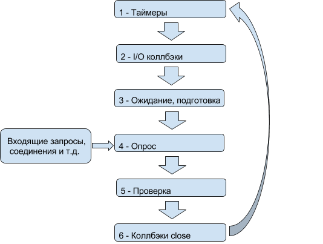

[Главная](../README.md#readme) > [Node.JS](./README_NODEJS.md#readme)

***

# Event Loop

## Фази Event loop

* **Таймеры** - виконання функцій зворотнього виклику, запралновані викликами `setTimeout()` i `setInterval()`
* **I/O колбекі** - виконання практично всіх функцій зворотнього виклику, за виключенням подій таймерів (були виконані раніше), `close` і `setImmediate()` (будуть виконані в подальшому)
* **Очикування, підготовка** - вікористовується виключно для внутрішніх цілей
* **Опитання** - Отримання і реєстрація нових подій `I/O`. Node.js може блокуватись на даному етапі
* **Перевірка** - Функції зворотнього виклику, ініційовані викликом `setImmediate()`, викликаються на цьому етапі
* **Функції зворотнього виклику події `close`** - наприклад `socket.on('close', ...)`

Між кожною ітерацією цикла подій Node.js перевіряє, чи очикується завершення будь-яких асинхронніх операцій введення/виведення, і закнчує роботу, якщо їх нема.

## Властивості і методи

* `setImmediate()` - Виконується вже на наступному циклі подій
* `process.nextTick()` - Виконується в кінці поточного цикла синхронних подій (відкладена ітерація, наприкад провести якусь ініціалізацію)